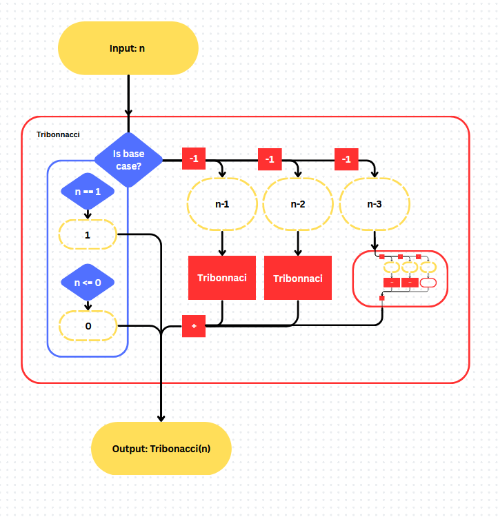
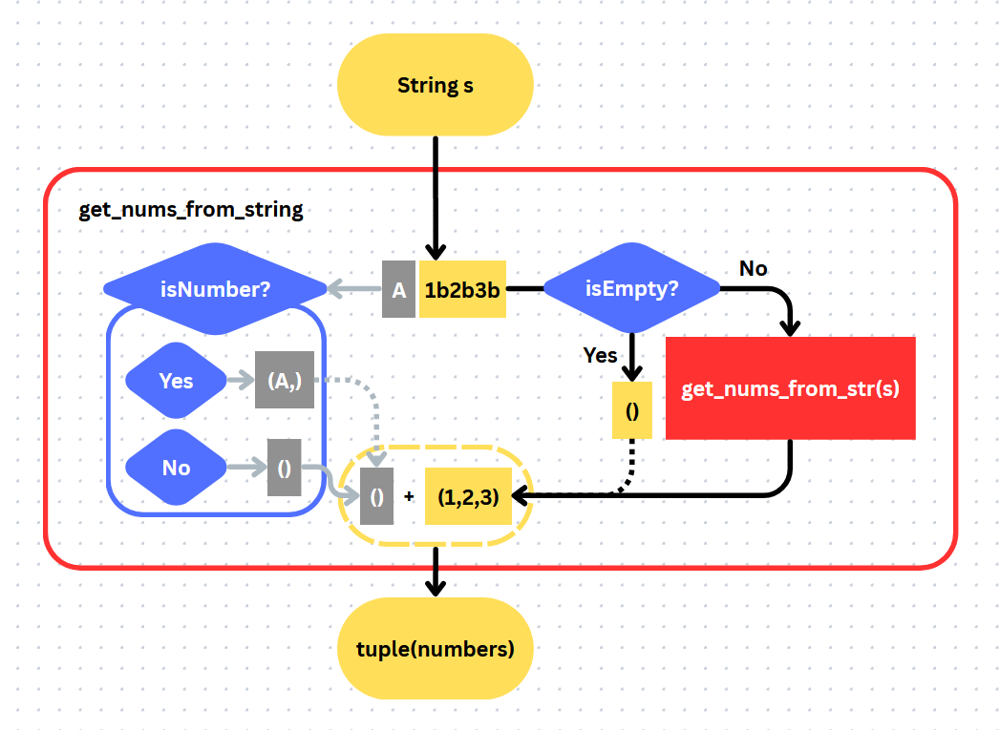
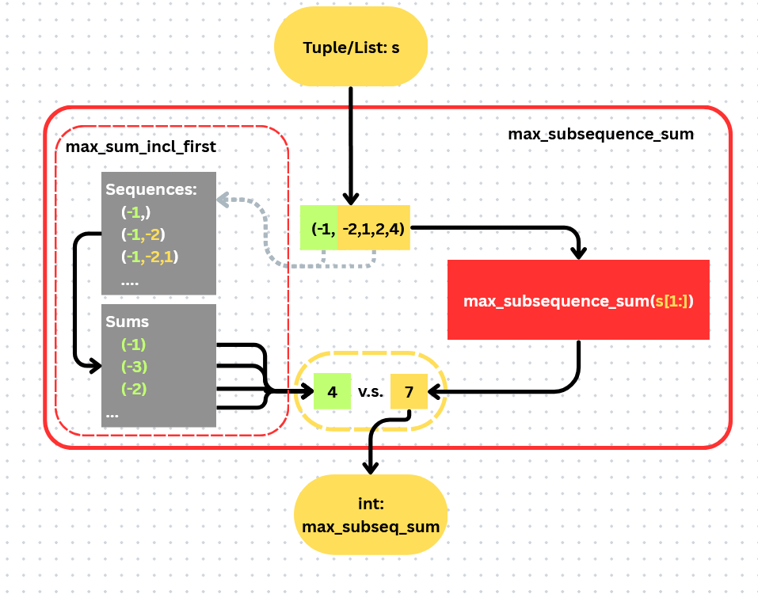
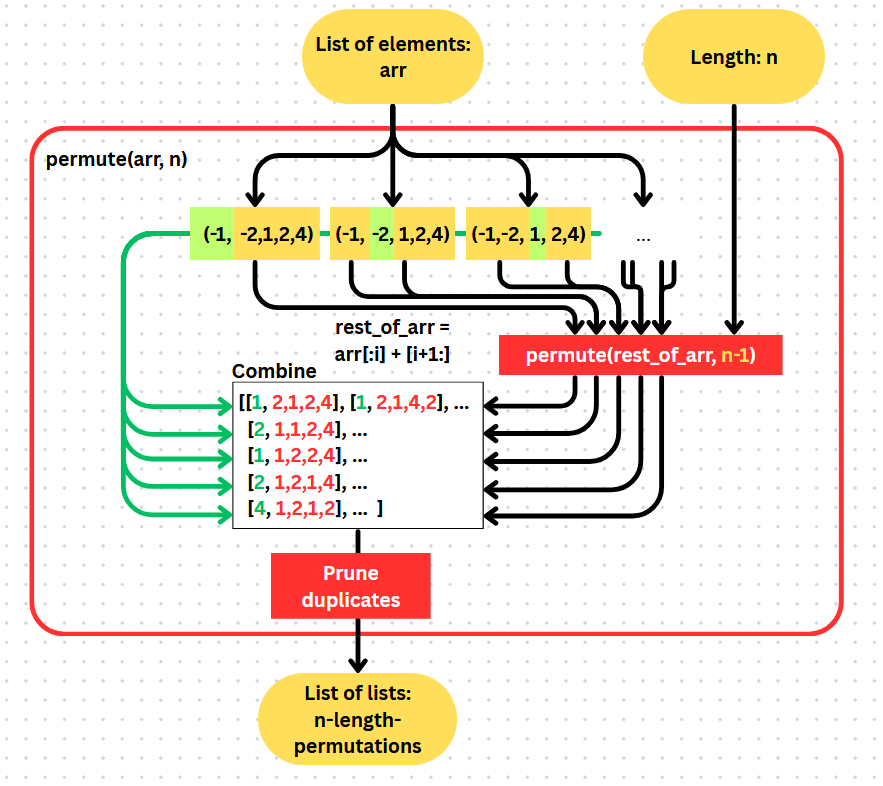

# W06 - Recursion Question solutions

* TOC
{:toc}

## Tribonacci

Straightforward and simple:

```python
def tribonacci(n):

    ## Base cases
    if n == 1:
        return 1
    elif n <= 0: # Improperly defined cases:
        return 0 # Ignore the value 

    ## Recursive step
    output = tribonacci(n-1) + tribonacci(n-2) + tribonacci(n-3)

    return output
```



(Practical tip: clarify with the examiner about what constitutes a Base Case when the question phrasing is unclear.)

## String Filtering

A peculiar problem much easier solved with a for-loop:

```python
def get_nums_from_string(s):

    def isNumber(character):
        ## Refers to the ASCII table: 
        ## Checks if a character is between 0 to 9 (inclusive)
        return ord('0') <= ord(character) <= ord('9') 

    output_list = [] ## Mutable list to collect numerical characters
    for char in s:
        if isNumber(char):
            output_list.append(s)
    return tuple(output_list) ## Conversion to tuple before returning
```

Alas, the question setter has a cruel heart and restricts our access to such fancy tools. We must trudge on with recursion.

```python
def get_nums_from_string(s):

    ## Base case: There are no numerical characters in an empty string
    if s is "":
        return tuple() 

    def isNumber(character):
        ## Refers to the ASCII table: 
        ## Checks if a character is between 0 to 9 (inclusive)
        return ord('0') <= ord(character) <= ord('9') 

    output = tuple()
    ## Determine whether to include first letter...
    if isNumber(s[0]):
        output += tuple(s[0])
    ## ...then process the latter half of string. 
    latter_half = get_nums_from_string(s[1:])
    output += latter_half

    return output
```



### Black Magic

<details>
    <summary><i>There's a very clean alternate solution here....</i></summary>
<div class="details-box" markdown="1">

As I was doing the writeup, I stumbled upon this solution. This solution is too good not to show, and it really showcases the power of expressions.

```python
def get_nums_from_string(s):

    def isNumber(character):
        ## Refers to the ASCII table: 
        ## Checks if a character is between 0 to 9 (inclusive)
        return ord('0') <= ord(character) <= ord('9') 

    output = tuple(filter(isNumber, s))
    return output
```

Notice also how it is completely readable (English-interpretable) despite being written fully in Python!
<br>
(barring the comment regarding under-the hood ASCII stuff)

</div>
</details>

## subtaskD (Maximum subsequence sum)

```python
def max_subsequence_sum(seq):
    
    ## Base case: the sum of an empty subsequence is 0
    if not(seq): ## <- Universal empty sequence detector
        return 0
    
    def max_sum_incl_first(seq):
        ## 1. Creates all subsequences containing the first element 
        #    (by slicing the sequence from 0 to end_idx)
        #    Note that range() is half-open-bounds, ie: [start,stop)
        ## 2. Then extracts the max sum acheivable by all subsequences created
        set_to_compare = map(lambda idx: seq[0:idx+1], range(len(seq)))
        output = max(map(lambda s: sum(s), set_to_compare))
        return output

    ## Compares this term to the max acheivable by the rest of the sequence
    x = max_sum_incl_first(seq)
    return max(x, max_subsequence_sum(seq[1:]))

```



If you really want to, you can also condense the 2-step operation on the left into a 1-liner to extract the result... (think of how you would combine nested `map(...)`'s)\
though I would get multiple headaches and a severe temptation to deduct marks (maybe a mild -1 or -2) for readability issues.

### Dark arts

<details> 
    <summary><i>— and why you should use one-liners sparingly (and comment rigourously)</i></summary>
<div class="details-box" markdown="1">

Just to illustrate how quickly code can become unreadable with "common-sense" and jazz, here is a pure for-loop version of the solution:

```python
max_subsequence_sum(seq):
    return max(map(lambda x: sum(x), (seq[i: j] for i in range(len(seq)) for j in range(i, len(seq)+1))))
```

... and the same thing with proper linebreaks, comments, and variable names!

```python
def max_subsequence_sum(seq):
    return max( ## Return max of...
        map( ## ...sums of subsequences...
            lambda subseq: sum(subseq),
            (
                seq[start:stop] ## ...for every possible [start:stop] pair.
                for start in range(len(seq))
                for stop in range(start+1, len(seq)+1)
            )   # ^ Note that range() is half-open-bounds, ie: [start,stop)
        )
    )
```

</div>
</details>

## Reimplementing tuple slicing

This is an exercise that I think can help you in your understanding of the default indexing mode that Python uses (for those of you who have heard of MATLAB and tried to program in it, you know what I mean).

I am also aware that I have not defined the restrictions clearly on this, hence you are free to treat this as a random excursion in code obfuscation (or algorithm analysis) instead.

```python
def slice(arr, start, stop, step):
    """
    input: (list) arr
    output: arr[start:stop:step] 
    """
    ## Base case:
    if (start >= stop) or (start > len(arr)):
        return []

    ## Adjusting format to generalize to a simpler problem
    if start != 0:
        return slice(arr[start:], 0, stop-start, step)

    ## Algorithm assumes that start == 0
    return [arr[0]] + slice(arr[step:], start-step, stop-step, step)
```

## Permutations

Owing to the difficulty of implementing this in pure recursion, the solution is less restrictive in what you can utilise and what you can not.

We will also start off with a more recursion-friendly re-phrasing _(pun not intended)_ of the requirements.

<div class="details-box" markdown="1">

Starting with this...

> Permute (without replacement) over all elements in the sequence

...rephrase this to...

> For each permutation, take out an element:<br>
... then take out another element<br>
... then take out another element<br>
... (repeated until n times)

See a recursive part yet? I'll make it clearer:

> For each permutation, take out an element:<br>
... then take out another element...<br>
(From this point on, each possible way to take out _n-1_ elements is itself a permutation.)

</div>

Some final polishing before this can be fully ported to Python:

> A n-length permutation involves taking out an element, and attaching (prepend) it to a "n-1"-length-permutation of the rest of the elements.\
\
All n-length permutations can be found by repeating the above for all elements for all "n-1"-length-permutations.

```python
def permute(arr, n):
    '''
    input: 
        (list[?]) arr = list of elements, 
        (int) n = length of each permutation
    output: 
        (list[list[?]]) ALL possible n-length permutations
    '''

    ## Base cases:
    if len(arr) < n: 
        ## Impossible to generate length-n permutations 
        #  from a set with less than n elements
        return [] ## Return an empty set
    if n == 0: 
        ## Successfully found all permutations
        return [[]] ## Return the set with an empty "base"
    
    output = []
    for i in range(len(arr)):
        initial_pick = arr[i] # <?> element
        rest_of_set = arr[:i] + arr[i+1:]
        for p in permute(rest_of_set, n-1): ## p = <list> permutation
            new_p = [initial_pick] + p
            ## ^ Note the difference in how I treat the initial pick and a permutation
            if new_p not in output: ## Prevent repetitions
                output.append(new_p)
    
    return output
```



_Footnote 1: For the keen eyed student, do try to not be confused by the way I mentioned "set" in comments. The "set" `{...}` is a data structure that I think deserves a separate lecture to cover. Do look out for it in future lessons!_

_Footnote 2: Usually, you'll be tested on raw implementation and have no access to external packages.. However, if you're looking to build something useful, there's always a [Python package](https://docs.python.org/3/library/itertools.html#itertools.permutations) out there to do this._
