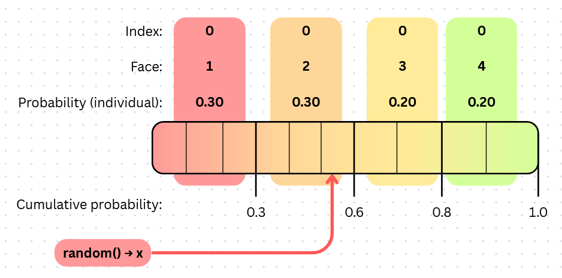
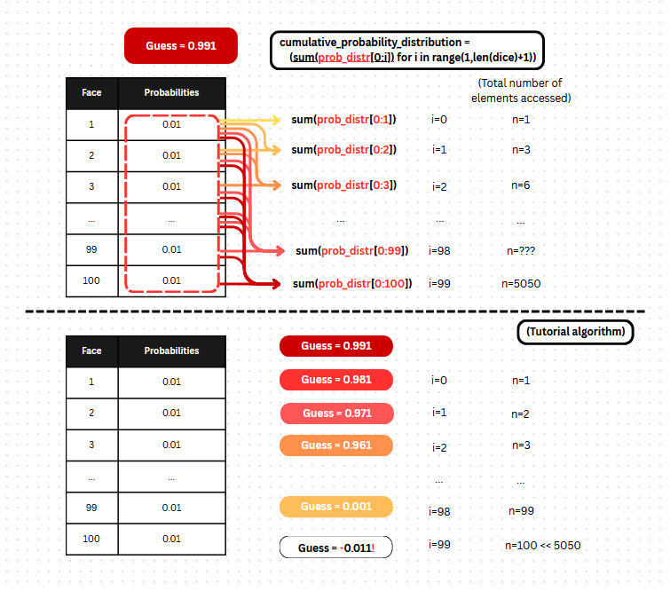

# W07 - List Comprehensions

* TOC
{:toc}

For this week's exercise, the theme is oriented around list comprehensions. However, we will also roughly touch on ideas of acquiring and inferring information/data that is not explicitly stated.

Do note that List Comprehensions are considered a iterable<sup>1</sup>, and are declared as such:

```python
List_Comp = (expression for var in iterable (if condition))
         or [expression for var in iterable (if condition)]
```

---

1. More precisely, List Comprehensions fall under a class of expressions called Generator Expressions, but the distinction shouldn't matter too much for this course

## Easy

**Question: Create a n-sided-dice using list comprehensions.**

This question is fairly easy, given that all of the information needed is already stated. We just need to apply the syntax of list comprehensions correctly:

```python
def n_sided_dice(n):
    """
        input: 
            (int) n: number of sides present on the dice.
        output:
            (tuple) dice: a tuple of values representing the sides of the dice.
    eg:
        six_sided_dice = n_sided_dice(6)
        (six_sided_dice -> (1,2,3,4,5,6))
    """
    ## recall that `range(...)` is half-open bounds: [start, stop)
    return tuple(i for i in range(1,n+1)) 
```

## Medium

**Question: Construct a weighted n-sided-dice, with the weight of each value given by `w_fx(face)`**

> Clarification: apologies for not covering this topic well, some of you have been confused by the idea of "weights".\
\
In the context of probabilistic outcomes, "weights" can be basically considered as "Odds", or the relative frequency of which outcomes appear. To be more precise, they are definite, unitless values which can be used to compare against each other.\
\
For example, 2 events with the same weight can be said to happen equally as often; a 10:1 ratio of weights then indicates that the former event happens 10x as often as often as the latter.

From the above definition of weights,  we can derive the probability of each face on the dice fairly simply:

```python
weight/total_weights = probability
```

We also note that the total weight of all faces is not given. However, we are given that `weight = w_fx(face)`, hence we can calculate `total_weights` by noting that it is <u>equal to the sum of each weight, given by w_fx(face).</u>

```python
dice_faces = tuple(i for i in range(1,n+1))
total_weights = sum(w_fx(face) for face in dice_faces) 
```

> Do also notice how this sentence is directly translatable to python:\
(1) sum... -> `sum(...)`\
(2) each [thing] -> `([thing] for i in [collection of thing])`\
(3) w_fx(n) -> `w_fx(n)`\
(ditto)

From this, we then have all the parts we need to solve this question.

**Final solution:**

```python
def weighted_dice(n,w_fx):
    """
        input: 
            (int) n: number of sides present on the dice.
            (func) w_fx: weighing function
        output:
            (tuple of tuples) dice: 
            pairs of values representing (side, probability) of the dice.
    eg:
        two_sided_wdice = n_sided_dice(2, lambda x: x)
        (two_sided_wdice -> ((1,0.33...), (2, 0.66...)))
    [HINT: The probabilities must add to 1]
    """
    dice_faces = tuple(i for i in range(1,n+1))
    total_weights = sum(w_fx(face) for face in dice_faces) 
    ## w_fx(face)/total_weights -> prob
    dice = tuple((face, w_fx(face)/total_weights) for face in dice_faces)
    return dice
```

## Hard

**Question: Given such a dice from question 2, we are asked to simulate a dice roll using `random()` from the package `random`. The function `random()` generates a random float uniformly in the half-open range (0.0 <= X <1.0).**

The difficulty in this question lies in figuring out how to map from a random variable given by `random()` to the dice-face representing the result.

> Note again, this above function is also translatable to python:\
`dice_face = map(rand_var_to_face, random())`\
However, do note also that since we are only dealing with 1 variable (instead of an iterable of them), we can just call the function on `random()`:\
`dice_face = rand_var_to_face(random())`

The key idea here is to transform a the uniformly distributed random variable `random()` into discrete "buckets". There are multiple ways to do this, but the way that this solution will use is essentially reinterpreting the probability distribution as a [cumulative probability distribution](https://en.wikipedia.org/wiki/Cumulative_distribution_function).

Consider the following image:



From this mapping, we can determine which "bucket" the random variable `random()` will land in by taking the first cumulative-probability cut-off that is larger. (A slightly more readable version of the tutorial is used in this example)

(Note also that the backslash can split lines while keeping logic as if in the same line)

```python
prob_distr = (face[1] for face in dice)
## for obvious reasons, I will not be abbreviating the variable below
cumulative_probability_distribution = \
        (sum(prob_distr[0:i]) for i in range(1,len(dice)+1))
dice_roll_idx = find_first_bucket(\
        random(), cumulative_probability_distribution)
```

Mini-Exercise: write a function `find_first_bucket(random_variable, cprob_distr)` to find the first "bucket" that the random variable lands in, returning the index of the "bucket".

Solution below: (without `find_first_bucket(...)`)

```python
from random import random

def weighted_dice_roll(dice):
    """
        input:
            (tuple of tuples) dice: 
            pairs of values representing (side, probability) of the dice.
        output:
            (int) side: returns result of rolling the dice
            Additionally, prints "Aw dangit" if the result is 1
    eg:
        dice = ((1,1.0), (2,0), (3,0), (4,0), (5,0), (6,0))
        weighted_dice_roll(dice)
        >>> Aw dangit
        >>> 1
        weighted_dice_roll(dice)
        >>> Aw dangit
        >>> 1    
        ...
    [Disclaimer: the tutor does not in any way, shape or form endorse gambling. 
     Do not replicate in real life.]
    """
    prob_distr = (face[1] for face in dice)
    cumulative_probability_distribution = \
            (sum(prob_distr[0:i]) for i in range(1,len(dice)+1))
    
    dice_roll_idx = find_first_bucket(\
            random(), cumulative_probability_distribution)
    
    result = dice[dice_roll_idx][0]
    ## Additional requirement: printing
    if result == 1:
        print("Aw dangit")

    return result
```

### Footnote

It should be noted that in the tutorial I did show another way to figure out to figure out which "bucket" that `random()` lands in:

```python
## dice is declared prior: 
##     dice[n][0] => face, dice[n][1] => probability
rolled = random()
idx = 0 ## initializing guess at index 0:
while True:
    rolled -= dice[idx][1]
    ## Stop condition: immediately stop after figuring out that the cumulative subtracted probabilities fully covers the initial rolled value
    if (rolled < 0): 
        break
    idx += 1
result = dice[idx][0]
```

While being less readable, this example is still worth analysing and understanding, as it is much more efficient at scale:\
Consider such a case when you have 100 faced-die to "roll":



See how many more underlying operations the "readable" code takes? The growth rate is roughly quadratic, which is a **huge** increase compared to the linear growth rate of the algorithm covered within the tutorials.

(If you're interested, you may take up CS2040 (or even CS3230) to continue learning more about what makes algorithms efficient)
