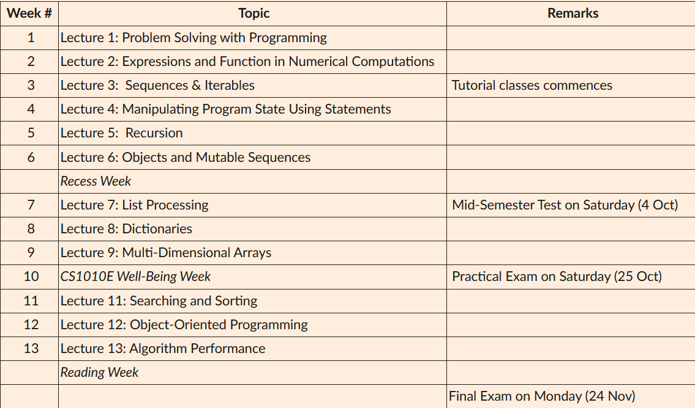
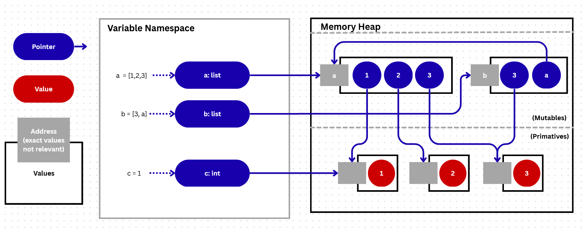

* TOC
{:toc}

> Pretext: this topic specifically is best meant to be read through with access to an IDE (like iPython!). Many concepts are hard to grasp with a superficial reading.\
TLDR:\
`collection = list() if (intention_to_change == True) else tuple()`

If you've looked into any other CS course, you may see that the typical progression of topics looks something akin to this:

1. Arithmetic and Math operations
2. Functions
3. If/else and loops
4. Lists
5. Recursion...

The keen-eye amongst you will then have noticed something about the typical progression of topics. In fact, it looks like this:

\
_image taken from Canvas > CS1010E > Modules > Course synopsis > Lesson Plan_

Considering that most logic can be expressed as either checking/adding items in/to a collection, it is extremely weird to delay teaching such a convenient way of organizing data, _the list_, until such a late timing. So, why do we move it back so much?

To be entirely honest, I don't fully understand the rationale too :P. But here is my blind shot at this: One caveat about lists is that it is extremely volatile by its nature of convenient modification, so read/write access to it have to be safeguarded very very carefully.

## A Foray into the deep dark

<div class="details-box" markdown="1">

Consider these 2 chunks of code:

```python
a = [1, 2, 3]
b = [a, 4, 5]
a[2] = 67
print(b)
```

Now try:

```python
a = [1, 2, 3]
c = (a, 4, 5)  ## <- Note the change of data types here
a[2] = 67
print(c)
```

See how this breaks the assumption of tuples being "immutable"? I'll give you a try at explaining for why this is.

<details>
    <summary ><i><u>An quiz to try out (Please don't skip!)</u></i></summary>
<div markdown="1">

Which of the following lists `a`, `b`, or `c`...

```python
a = [0] * 3
b0 = 0
b = [b0] * 3
c0 = [0]
c = [c] * 3
```

...will NOT have 2 zeros ("0") after modifying one of them?<br>
i.e.: after running `a[0] = 1`, `b[0] = 1`, and `c[0][0] = 1`

<details>
    <summary>Answer:</summary>
    <code>c</code>. The result of <code>c[0][0] = 1</code> will be <code>[[1],[1],[1]]</code>
</details>
</div>
</details>

</div>
The reason for such obscure behaviour has to do with the Python's memory model:



>_Disclaimer: The above diagram is oversimplified and is only done in accordance to my own practicality-oriented understanding, may not correspond 1-to-1 with Python's actual implementation. Do not use this as an actual technical reference_

As you can see, all variables in python act like pointers to an address in the memory heap.\ (You can actually see this address! use: `id(...)`).
When you initialize a list of lists, all nested lists will be stored in memory, and there'll be a "master-list" that contains addresses of all the lists (may be fun to think about this one... and do verify with the above quiz!). The unravelling and rendering logic is a bit finicky and requires a separate topic to deal with, but this is more than enough detail to properly solve problems using lists, let's move on.

## Questions

We will move onto the topic of list manipulations by using the tutorial questions as examples. To remind you, here is a summary of almost all useful list methods:

```python
a = list()        ## a = []
a.append(1)       ## a = [1]
a.extend((4,5,6)) ## a = [1, 4, 5, 6]
a.remove(4)       ## a = [1, 5, 6]
pos = 3
a.insert(pos, 6)  ## a = [1, 5, 6, 6]]
#------
b = a             ## b = [1, 5, 6, 6]
a[1] = 7          ## b(!) = [1, 7, 6, 6]
b = a.copy()      ## b = [1, 7, 6, 6] 
#     ^^^^ (changes to a will no longer affect b)
```

_Optional exercise: It may help your understanding to draw out diagrams to visualize how each operation changes the memory space._

### Q1: Recursive Filter

Recall that a shallow filter is doable via 2 ways:

```python
def filtering_func(element):
    ... # Returns either True or False
L = list(...)
f1_L = list(filter(filtering_func, L))
f2_L = [e for e in L if filtering_func(e)]
```

However, as per CS1010E tradition, we like to restrict you to all these fancy tools and implement the same behaviour using recursion:

```python
def list_filter(func, lst):
    if ...:
        return ...
    elif ...:
        return ...
    else:
        return ...
```

<details>
    <summary ><i>Solution</i></summary>
<div class="details-box" markdown="1">

```python
def list_filter(func, lst):
    if not lst: ## Base Case/Stop Cond.: Empty list 
        return []

    ## Include element in return list if func(element) satisfied
    if func(lst[0]): 
        return [ lst[0] ] + list_filter(func, lst[1:])
    ## Otherwise not
    else:
        return list_filter(func, lst[1:])
```

</div>
</details>

This solution works for any lists that are considered "flat" (ie: no nested lists). However, what if we wanted a way to filter for elements in a potentially nested list?

### Q2.1: Deep filter

Now the list could have potentially nested elements. Our job is to filter out elements while preserving the list structure:

As such:

```shell
In [..]: L = [2, [4, 3], [1, 2], 5]
In [..]: deep_filter(lambda x: x > 2, L)
Out[..]: [[4, 3], [], 5]
```

<details>
    <summary ><i>Here is the solution:</i></summary>
<div class="details-box" markdown="1">

```python
def deep_filter(func, lst):
    ## Base Case/Stop Cond: Empty List
    if not lst:
        return []
    
    ## If element is not a list, process it as usual
    if type(lst[0]) != list:
        if func(lst[0]):
            return [lst[0]] + deep_filter(func, lst[1:])
        else:
            return deep_filter(func, lst[1:])
    ## If element is a list, nest the processing
    else:
        return [deep_filter(func, lst[0])] + deep_filter(func, lst[1:])

```

</div>
</details>

### Q2.2: Deep Filter V2

This edition asks for you to solve it without list slicing or list concatenation, and use `.append()` in your implementation.

> A key thing to note is that since recursion commonly relies on list slicing (`a[0] // a[1:]`) to separately process parts of the list, the above restrction is a very gentle hint towards utilizing iteration as part of your solution.

<details>
    <summary ><i>Solution as follows:</i></summary>
<div class="details-box" markdown="1">

```python
def deep_filter(func, lst):
    result = []
    
    for elem in lst:
        if type(elem) != list:
            if func(elem):
                result.append(elem)
        ## If element is a list, nest the processing
        else:
            result.append(deep_filter(func, elem))

    return result
```

</div>
</details>
