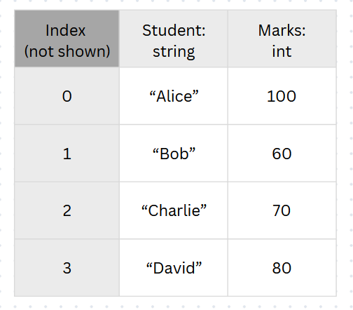
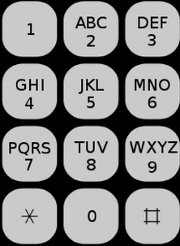

* TOC
{:toc}

The concept of dictionaries is born out of a simple but common occurance:
**Searching up values using other values**

Think of how you might organize data for students:



This above method corresponds to the following code, and may need a dedicated search function:

```python
student_marks = (
    ("Alice", 100)
    ("Bob", 60)
    ("Charlie", 70)
    ("David", 80)
)

def search_from_arr(arr, key):
    for i in range(len(arr)):
        if arr[i][0] == key:
            return arr[i][1]
    return None ## if no entry found

## eg: search_from_arr(student_marks, "Alice")
```

This is very much unwieldy and crude, so what if there was a better way to organize this information?

> Introducing: _the Dictionary_

```python
student_marks = {
    "Alice": 100,
    "Bob": 60,
    "Charlie": 70,
    "David": 80
}

# Accessing elements
student_marks["Alice"] # -> returns 100
```

See how much more convenient that is? That is basically the whole point of dictionaries.

<div class="details-box" markdown="1">

A fun little exercise is to attempt finding the key given the value... Think if you could figure out any way of doing so?

<details>
    <summary ><i>Quiz solution:</i></summary>
<div markdown="1">

Well, honestly there isn't much you can do other than iterating through the whole dictionary and finding the values:

```python
def search_key(d, value):
    ## Note: any particular output value does 
    #    not necessarily guarantee a unique key!
    #  We will have to search through the dictionary 
    #    for all keys that return a value:
    output_list = []
    for key in d:
        if d[key] == value:
            output_list.append(key) 
    return output_list
```

</div>
</details>
</div>

## Questions

Again, here is a (non-exhaustive) list of useful dictionary methods:

```python
dict[key]                   ## Returns the item... or throws an error
dict.get(key, default=None) ## ^ Same thing but no error
key in dict                 ## Detects if key is in dict
dict.keys()                 ## List of keys
dict.values()               ## List of values
dict.items()                ## List of (key, value) pairs
len(dict)                   ## number of items in the dictionary
```

### Q1. Anagram

An anagram is a word or a phrase formed by rearranging the letters of a different word or phrase, using all the original letters exactly once.

Your task here is to check if 2 words are anagrams of each other (ignoring spaces).

<details>
    <summary ><i>Solution</i></summary>
<div class="details-box" markdown="1">

An idea could be to count the number of each letter, and then compare between the words to check if they are the same.

This can be mostly acheived using a dictionary (for each word) to update and store letter counts.

```python
def anagram(word1, word2):
    def count_letters(word):
        letter_counts = dict()
        for letter in word:
            if letter != " ":
                ## This way of writing avoids brancing logic
                letter_counts[letter] = letter_counts.get(letter, default=0) + 1
        return letter_counts
    return count_letter(word1) == count_letters(word2)
```

</div>
</details>

### Q2.1. T9: Number representation

If you've dug out your grandpa's old phone, you may have seen something similar to this:



The basis of this keypad is [T9](https://en.wikipedia.org/wiki/T9_(predictive_text)), a predictive text technology for mobile phones.

We can represent the keypad in two different ways:

1. A list such that each element is a string of characters associated
with the number which is the element’s index, which gives us:\
`[" ", "", "abc", "def", "ghi", "jkl", "mno", "pqrs", "tuv", "wxyz"]`
2. A dictionary where the keys are the characters and the values are the associated number which gives us:\
`{" ": 0, "a": 2, "b": 2, ..., "y": 9, "z": 9}`

Our first subtask is to write 2 functions: `to_dict(keyL)` and `to_list(keyD)` which takes in a keypad in either the list/dictionary representation and returns its other counterpart (ie: `<list> <=> <dict>`)

<details>
    <summary ><i>Solution</i></summary>
<div class="details-box" markdown="1">

This is ultimately, an exercise in dictionary instantiation and element access.

For both tasks, the hard part is in thinking about the correct mapping to define out dictionary:

`keyD: dict[char, int]`: We shall define this as a lookup table, using "letters" as the keys, and returning the "number key" to press on the keypad.

```python
def to_dict(keyL):
    ## Instantiating initial values (no requirement)
    keyD = dict()

    ## index corresponds to the number key 
    for i in range(len(keyL)):
        for character in keyL[i]:
            keyD[character] = i

    return keyD

def to_list(keyD):
    ## Instantiating initial values (list of empty strings)
    keyL = ["" for i in range(10)] # (10 input keys, from 0 to 9)
    
    ## index corresponds to the number key 
    for character, i in keyD.items(): ## cool strat
        initial_list[i] += character ## string + string

    return keyD
```

</div>
</details>

### Q2.2. T9: Wordify

One cool thing about T9 is that since it's a basically an autocomplete feature, it'll search for a plausible word given a random numerical input. (eg: it'll guess what "`43468`" stands for, and if it doesn't guess correctly then it's basically a "`43468`"). From this, we only need to know which letters are on which keys in order to figure out how to use such a keypad!

Now given that keyD and keyL are global variables (accessble from within functions), try and write a function `to_nums(word)` that returns an integer representing the numbers to be pressed to return the word.

<details>
    <summary ><i>Solution</i></summary>
<div class="details-box" markdown="1">

Again, this is not as hard as it seems once you understand what `keyD` stands for.

Recap:
> `keyD: dict[char, int]`: We shall define this as a lookup table, using "letters" as the keys, and returning the "number key" to press on the keypad.

From this definition, we just have to string together the numbers given back as we look up the dictionary!

```python
def to_nums(word):
    output = "" ## using a string for ease of concatenation
    
    for letter in word:
        output += str(keyD[letter]) ## Be careful of the return value type!

    return int(output)
```

An alternate solution via directly manipulating numerical values:

```python
def to_nums(word):
    ## Code golf, anyone?
    return reduce(lambda x, y: x*10 + y, keyD[c] for c in word, 0)
```

</div>
</details>